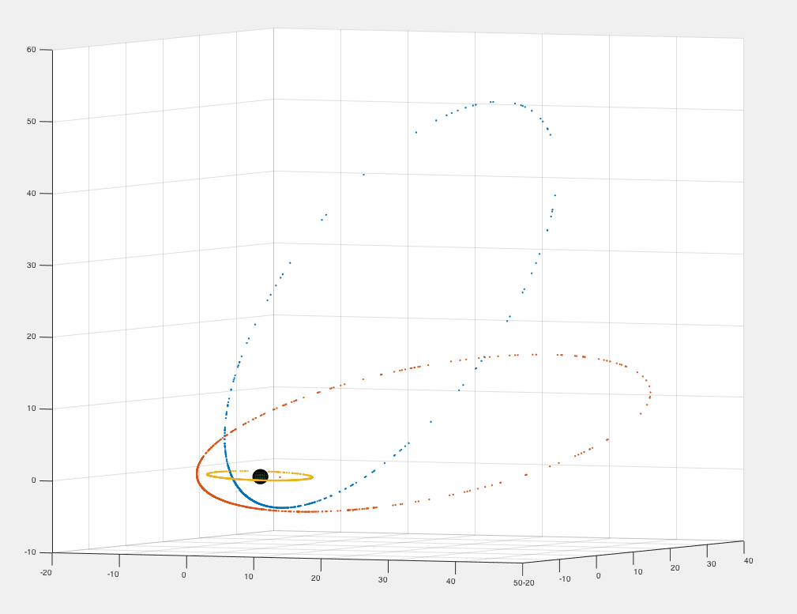
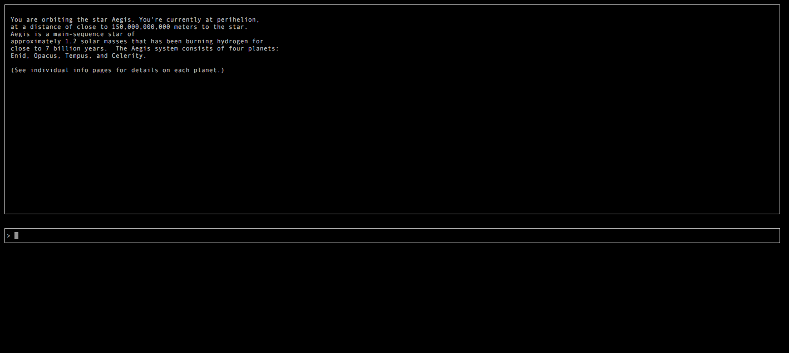
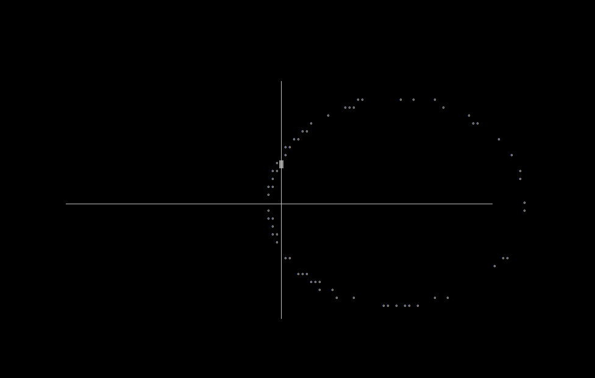
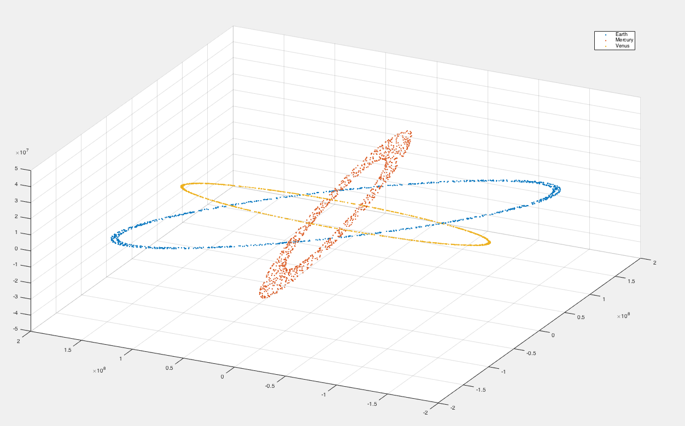

# General

**Pinned:** Main files are twobody.lisp and game.lisp. Both grid.lisp and curses.lisp contain some support code for the game graphics, which may be interesting.

The goal of this project is to support real time simulation of celestial mechanics, at first using Newtonian equations of motion. This project came out of an idea I had for building a text-rpg-like space battle game that is played in real time and makes the player base their strategy on things like

* position of objects in the system (planets, asteroids),
* amount of fuel, ammo,
* ship damage,
* gravitational effects of large objects (stars, planets, etc.).

# Structure

Rather than tackle the n-body problem, I think I will start by building good support for general two-body problem situations, mostly involving one mass that is much larger than the other. This simplifies the calculation of orbits of many planets and ships around a single comparatively massive star. Eventually I do plan on calculating orbital perturbation as small ships pass through the gravitational field of larger objects like planets or moons.

My plan is to build a physics engine that will handle all the math for each two-body problem. The game client will pass parameters to the engine for a two-body problem that needs solving, and the engine will spit out the answer. I think that separation will simplify building clients.

# Progress

I am able to define orbits in terms of five elements: [inclination](https://en.wikipedia.org/wiki/Orbital_inclination), [longitude of the ascending node](https://en.wikipedia.org/wiki/Longitude_of_the_ascending_node), [argument of periapsis](https://en.wikipedia.org/wiki/Argument_of_periapsis), [eccentricity](https://en.wikipedia.org/wiki/Orbital_eccentricity), and [semimajor axis](https://en.wikipedia.org/wiki/Semi-major_axis). Then, given those initial conditions, I can find the point in 3d space of a body at an arbitrary point in time through some math. Here is a plot of three orbits I generated using this code.

I wrote the beginnings of an interface for the game. This involved a bunch of work with curses, a C library for handling term cap and drawing optimizations. At first I was using the :cl-ncurses Common Lisp library, but I ran into some problems. I found a 'curses.lisp' file written by Timofei Shatrov (https://common-lisp.net/project/lifp/uwar.htm), and have been using my own extended version of that to do graphics. The only thing you can do in the game right now is query a database of information about different bodies in the system, like planets. The progress up to this point has mostly been behind-the-scenes type things, like making infrastructure for doing curses graphics. So I think progress be more visible from now on.

Here is a picture of the current interface.

And here is a screenshot of the result of some curses code plotting points on an elliptical orbit around a mass at the origin.

**December 23, 2015** I fixed some issues with my orbital math. I ran through a calculation by hand of the orbit of the earth at an arbitrary point in time past its perihelion passage. This allowed me to see how the units line up as they pass from equation to equation. Once that was all on paper, it wasn't too hard to fix the code by "standardizing" my use of units. So I was able to get the orbital elements of Mercury, Venus, and Earth, from here [NASA factsheet](http://nssdc.gsfc.nasa.gov/planetary/factsheet/), and from Martin Zombeck's *Handbook of Space Astronomy & Astrophysics*. Here is a graph of 1000 days worth of each of those orbits.

# Running

I have been using a hack to run my game program. The file 'newcore.lisp' will, when passed a filename as a command line argument, compile a new sbcl core file that includes the libraries necessary for this project. The file 'main.lisp' has the shebang that uses this new file to execute. I am doing this because I am using quicklisp to load dependencies, and once I get around to actually installing them the run process will be cleaner.
