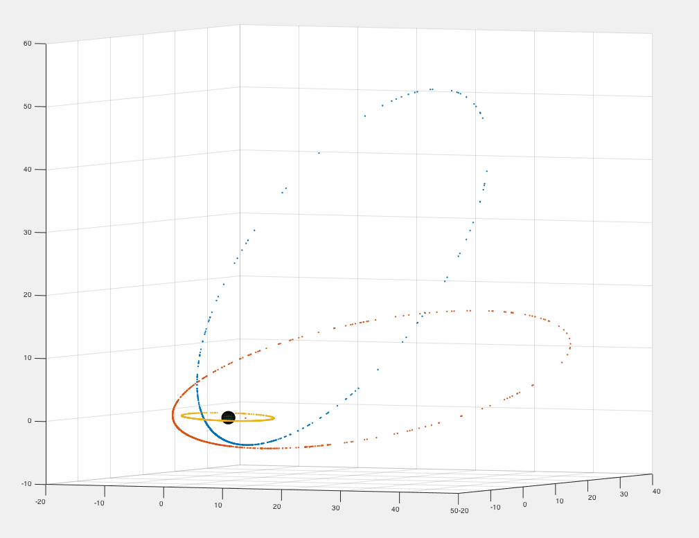

# General

The goal of this project is to support real time simulation of celestial mechanics, at first using Newtonian equations of motion. This project came out of an idea I had for building a text-rpg-like space battle game that is played in real time and makes the player base their strategy on things like

* position of objects in the system (planets, asteroids),
* amount of fuel, ammo,
* ship damage,
* gravitational effects of large objects (stars, planets, etc.).

# Structure

Rather than tackle the n-body problem, I think I will start by building good support for general two-body problem situations, mostly involving one mass that is much larger than the other. This simplifies the calculation of orbits of many planets and ships around a single comparatively massive star. Eventually I do plan on calculating orbital perturbation as small ships pass through the gravitational field of larger objects like planets or moons.

My plan is to build a physics engine that will handle all the math for each two-body problem. The game client will pass parameters to the engine for a two-body problem that needs solving, and the engine will spit out the answer. I think that separation will simplify building clients.

# Progress

I am able to define orbits in terms of five elements: [inclination](https://en.wikipedia.org/wiki/Orbital_inclination), [longitude of the ascending node](https://en.wikipedia.org/wiki/Longitude_of_the_ascending_node), [argument of periapsis](https://en.wikipedia.org/wiki/Argument_of_periapsis), [eccentricity](https://en.wikipedia.org/wiki/Orbital_eccentricity), and [semimajor axis](https://en.wikipedia.org/wiki/Semi-major_axis). Then, given those initial conditions, I can find the point in 3d space of a body at an arbitrary point in time through some math. Here is a plot of three orbits I generated using this code.

